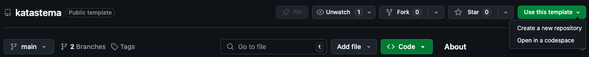
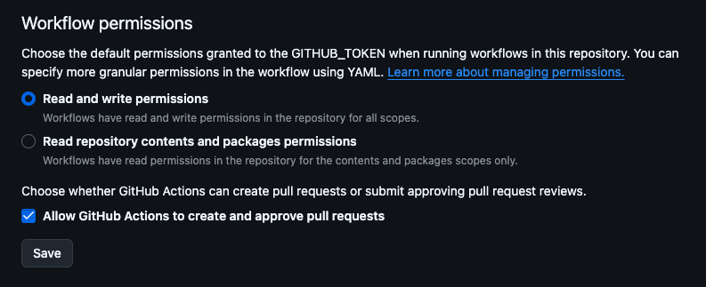

# Katastema

> When the emotions which disturb the soul are removed, those which produce pleasure enter into it to take their place.

[](https://github.com/fTrestour/katastema/actions/workflows/ci.yml)

This is a static site builder using Bun, Tailwind CSS, and @kitajs/html.
It focuses on simplicity, while providing a modern component-driven development experience.

## Getting Started

Create your own repository by using this repository as a template:


## File Structure

The is organized as follows:

- **`src/build.ts`**: This is the file that builds your website. You shouldn't need to modify it.
- **`src/pages/`**: This directory hosts the site pages. Each `.tsx` file in this directory represents a page, and the default export of each file will be the page content.
- **`dist`**: Your site is built there.
- **`src/styles.css`**: This is the source Tailwind CSS file where you can add and customize your styles.
- **`src/layout.tsx`**: This file contains the base structure to render all your pages. It includes the meta header and other common elements shared across all pages.
- **`src/components/`**: This directory is used to store components for your design system, allowing for reusable and consistent UI elements across your site.
- **`src/static/`**: This directory is designated for storing static files that should be included as-is in your website. These files are directly copied to the `dist` directory during the build process. This is particularly useful for assets like images, fonts, or any other files that do not require processing or compilation, ensuring they are available in their original form on your site.

## Github Actions

This project uses GitHub Actions to:

- **Test the build** is not broken when pushing on any branch.
- **Create a release** containing the built website in an archive file - both `.tar.gz` and `zip` - when pushing on `main`
- **Pull updates from the template repository** into your own project and creates a PR for the update. By default, updates are fetched once a day. They can also be triggered manually : "Actions" > "Template update" > "Run workflow". To have this behaviour work properly, you should update workflow permissions beforehand in "Settings" > "Actions" > "General", like so:
  

## Create your amazing website!

### Prerequisites

- [Bun](https://bun.sh/) (v1.1.33 or later)

### Installation

Install dependencies:

```bash
bun install
```

### Development

Go to `.env` and set all the values properly.
This file is commited with the others, so don't put any secrets in there.

To start the development server, which watches for changes in your TypeScript and CSS files, run:

```bash
bun dev
```

You are now ready to go!

## Todo

- [ ] Imports validation?
- [ ] analytics?
- [ ] CI that makes a report on the built site diff? Maybe use the sitemap?
- [ ] Improve error handling for the build, make error messages foolproof
- [ ] Handle 404 through [service-worker](https://medium.com/@straker/custom-404-page-without-a-server-2dad21c8f480)
